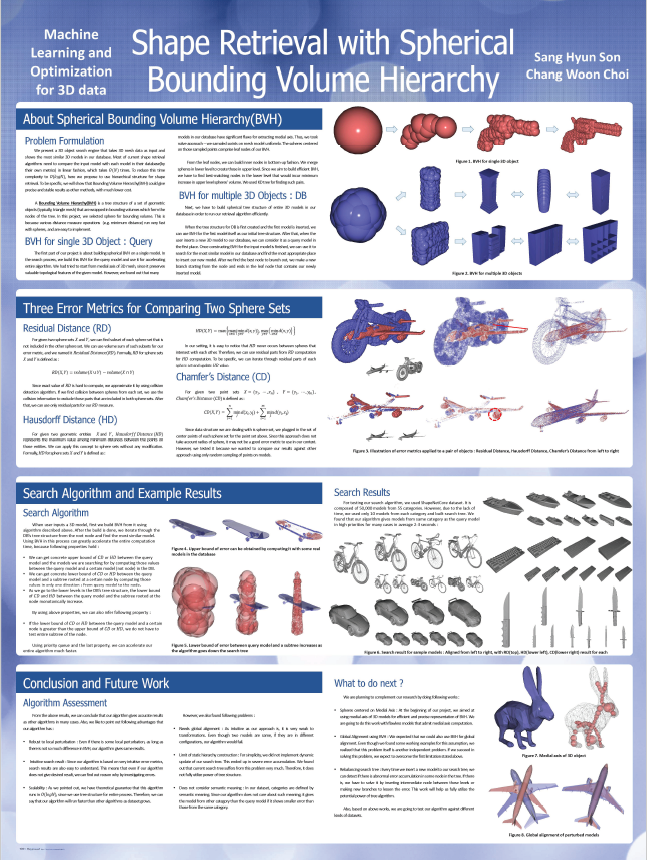

# Course-Project_Machine_Learning_and_Optimization_for_3D_Data
This repository contains code that submitted as term project for **430.658 Machine Learning and Optimization for 3D Data** course at SNU in 2019.
Please refer to the [poster](https://github.com/SonSang/Course-Project_Machine_Learning_and_Optimization_for_3D_Data/blob/master/Paper/poster.pdf) and [paper](https://github.com/SonSang/Course-Project_Machine_Learning_and_Optimization_for_3D_Data/blob/master/Paper/Shape%20Retrieval%20with%20Spherical%20Bounding%20Volume%20Hierarchy.pdf) for details.

## Poster

  

